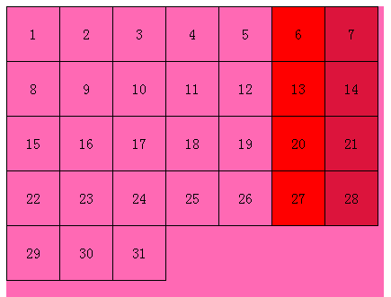

# CSS3新增的常用伪类选择器
 >CSS3增加了许多新的伪类选择器 但部分浏览器兼容较差
## :first-child
        选择第一个子元素，但是区别于jQuery的选择器，first-child会选择父元素的第一个子元素，其实也就是兄弟元素的第一个冒号前最好写上标签要不然将会选择所有的元素
## :last-child
        同上选择最后一个子(xiong di)元素
```css
    li:first-child,li:last-child{
        color:red;
    }
    /*第一个最后一个Li标签的文字都会变红色*/
```
## :nth-child(n)
* 如果n填写的是数字那么会选择父元素的子元素的第n个元素 第一个标签对应的是数字1
* 还可以在括号内填写n为参数的算式，n会从0开始累加，直到超过范围，但是算式中第一项必须含有n
    * 例如`:nth-child(2n)`代表选择为偶数的标签
    * `nth-child(2n-1)`代表选择为奇数的标签
    * `nth-child(n+5)`代表从第五项开始选择到最后一项
##简单日历的例子：
```html
<!DOCTYPE html>
<html lang="en">
<head>
    <meta charset="UTF-8">
    <title>$别看我$</title>
    <style>
        li{
            padding:0;
            display: block;
            float: left;
            width: 58px;
            height: 60px;
            list-style: none;
            border-left: 1px solid black ;
            border-top: 1px solid black ;
            text-align: center;
            line-height: 60px;
        }
        ul{

            padding: 0;
            width: 420px;
            height: 500px;
            margin:0 auto;
            background-color: hotpink;
        }
        li:nth-child(n+22){
            border-bottom: 1px solid black ;
        }
        li:nth-child(n+29){
            border-top:none;
        }
        li:nth-child(31){
            border-right:1px solid black ;
        }
        li:nth-child(7n-1){
            background-color: red;
        }
        li:nth-child(7n){
            border-right:1px solid black ;
            background-color: crimson;
        }
    </style>
</head>
<body>
<ul>
    <li>1</li>
    <li>2</li>
    <li>3</li>
    <li>4</li>
    <li>5</li>
    <li>6</li>
    <li>7</li>
    <li>8</li>
    <li>9</li>
    <li>10</li>
    <li>11</li>
    <li>12</li>
    <li>13</li>
    <li>14</li>
    <li>15</li>
    <li>16</li>
    <li>17</li>
    <li>18</li>
    <li>19</li>
    <li>20</li>
    <li>21</li>
    <li>22</li>
    <li>23</li>
    <li>24</li>
    <li>25</li>
    <li>26</li>
    <li>27</li>
    <li>28</li>
    <li>29</li>
    <li>30</li>
    <li>31</li>
</ul>
</body>
</html>
```
 


