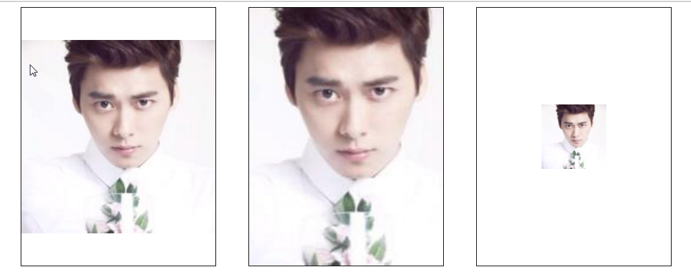
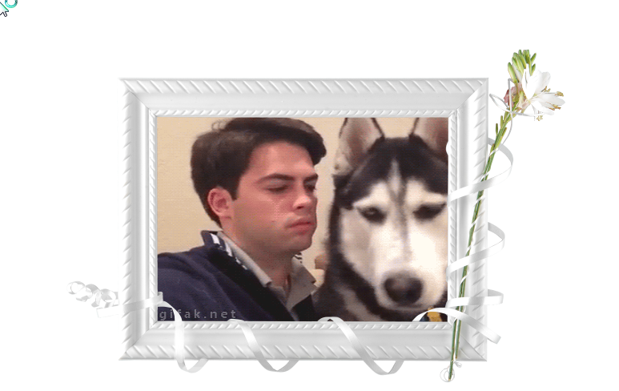

# C3背景新玩法
## background-size属性
### background-size语法
在之前设定盒子的背景图时，背景图不能进行缩放，只能对图片进行剪裁，而background-size属性解决了这个问题，可以让背景图像Img标签一样进行处理。
* background-size有以下几个值
    * cover 覆盖 背景图保持长宽比放大，放大到充满整个盒子
    * contain 包含 背景图保持长宽比放大，放大到充满长或者宽
    * mpx npx 设置背景图的 宽高，可能会改变背景图的比例 显示不正常
### 小示例
```html
<!DOCTYPE html>
<html lang="en">
<head>
    <meta charset="UTF-8">
    <title>$想不想知道后面写的是什么$</title>
    <style>
        div{
            width: 300px;
            height: 400px;
            float: left;
            margin-left: 50px;
            border: 1px solid black;
            background: url("img/lyf.jpg") no-repeat center;
        }
        div:nth-child(1){
            background-size: contain;
        }
        div:nth-child(2){
            background-size: cover;
        }
        div:nth-child(3){
            background-size: 100px 100px ;
        }
    </style>
</head>
<body>
<div ></div>
<div ></div>
<div ></div>
</body>
</html>
```
运行结果如图:

## 多重背景
> C3可以给一个盒子加载多个背景图，并可以一起显示
### background语法
`background: 图片1的各种设置，
图片2的各种设置，
图片3的各种设置；`
### 相框案例
```html
<!doctype html>
<html lang="en">
<head>
    <meta charset="UTF-8">
    <title>Document</title>
    <style>
        .picbox {
            width: 623px;
            height: 417px;
            margin: 100px auto;
            background: url('img/bg1.png') no-repeat top left,
            url('img/bg2.png') no-repeat top right,
            url('img/bg3.png') no-repeat bottom right,
            url('img/bg4.png') no-repeat bottom left,
            url('img/dog.gif') no-repeat center/400px 270px;
        }
    </style>
</head>
<body>
<div class="picbox">

</div>
</body>
</html>
```
运行结果如下:
