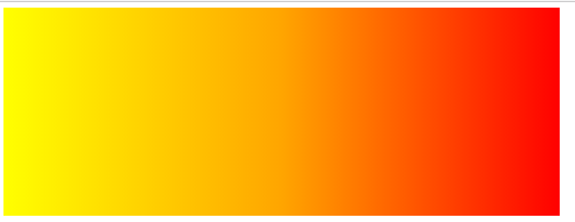
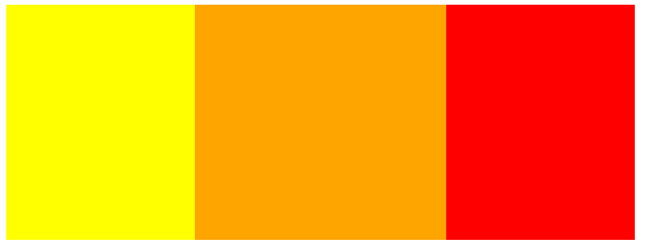

# C3背景颜色的渐变
## 线性渐变
>线性渐变是沿着一个方向颜色产逐渐的变化
### 线性渐变的语法
`background:linear-gradient(to 目标方向 ,颜色,渐变到的颜色)`
线性渐变产生的颜色差在CSS中可以理解为背景图片，而不是背景颜色，所以必须用background-image或者background来进行设置。
* 目标方向可以是以下几种
    * top 从下到上
    * bottom 从上到下
    * left  从右到左
    * right 从左到右
    * ndeg  n可以替换成度数 完全可以360度自定义方向
* 颜色的渐变可以设置多种颜色会一个向下一个颜色渐变
### 最简单的渐变代码实现
```html
<!DOCTYPE html>
<html lang="en">
<head>
    <meta charset="UTF-8">
    <title>$想不想知道后面写的是什么$</title>
    <style>
        div{
            width: 800px;
            height: 300px;
            background: linear-gradient(to right,yellow,orange,red);
        }  
    </style>
</head>
<body>
<div></div>
</body>
</html>
```
运行结果如下:

## 渐变过程中颜色的范围
`background:linear-gradient(to(目标方向),颜色 百分比,渐变到的颜色 百分比，渐变到的颜色 百分比)`
### 百分比的详解
* 百分比是指颜色渐变方向起始的百分比，颜色渐变方向末尾的百分比，带有百分比会阻止颜色的渐变，改变成到百分比立即切换，如果某个颜色没有写开始或者末尾百分比，颜色会正常渐变
    * 由于第一个颜色起始肯定是0 所以只需要写末尾的百分比
    * 由于最后一个颜色末尾肯定是100% 只需要写起始的百分比
### 代码示例
```html
<!DOCTYPE html>
<html lang="en">
<head>
    <meta charset="UTF-8">
    <title>$想不想知道后面写的是什么$</title>
    <style>
        div{
            width: 800px;
            height: 300px;
            background: linear-gradient(to right,yellow 30%,orange 30%,orange 70%,red 70%);
        }  
    </style>
</head>
<body>
<div></div>
</body>
</html>
```
运行后结果如下：

## 径向渐变
> 色彩渐变按照圆的半径扩散
### 径向渐变的语法 
`background: radial-gradient( mpx npx at 位置，颜色 百分比，颜色 百分比)`
和线性渐变类似，区别在于m,n分别代表半径，当m=n或者只写m时，渐变是呈现圆形，否则呈现椭圆。
* 位置处可以填写以下几种位置
    * top       可以和除了bottom的搭配
    * bottom    可以和除了top的搭配
    * left      可以和除了right的搭配
    * right     可以和除了Left 的搭配
    * center    中心，可以和以上四种搭配
    * x y       x y分别代表横纵坐标 
### 小太阳示例
```html
<!DOCTYPE html>
<html lang="en">
<head>
    <meta charset="UTF-8">
    <title>$想不想知道后面写的是什么$</title>
    <style>
        html{
            height:100%;
        }
        body{
            margin: 0;
            background: radial-gradient(300px at top right ,orangered ,yellow,skyblue ) ;
            height:100%;
        }  
    </style>
</head>
<body>
<div></div>
</body>
</html>
```
运行结果如下:

### 关于小案例中body的注意
body本身的高度默认是0，他的高度一般由内容撑开，所以不能直接设置背景，当填写高度100%时候继承父元素html的高度，父元素填写100%的时候，会继承根元素的高度这时Body的高度就是浏览器一屏幕的高度。
