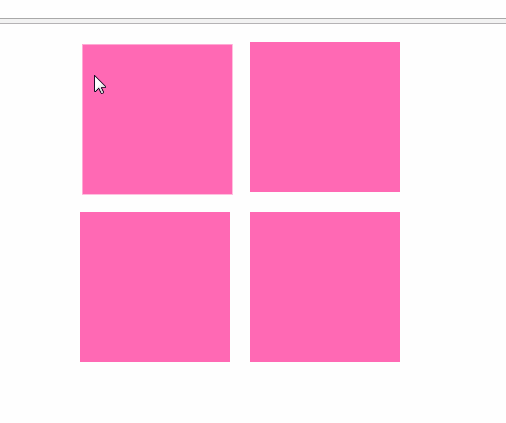

# transform 2D变换
>利用transform可以进行一些2D的动画效果
## translate 位移
`transform:translate(50px,50px)`向右向下移动50px，第一位是x轴正方向是右，第二位是y轴，下是正方向。
## rotate 旋转
`transform:rotate(3600deg)` 顺时针旋转3600度，也就是转10圈。
## scale 缩放
`transform:scale(.5,.5)` 宽高分别缩放到0.5倍，缩小一半。
* 如果放大，超出屏幕范围，那么会拉长滚动条
## skewX 扭曲
`      transform: skewX(-45deg);`设置x轴扭曲45度（真的会有人用吗）
* 也可以设置两个值，分别设定x和y当x和y相当时，元素会消失，不推荐。
## transform-origin 变换中心点
所有的变换以这个点为基准.
`transform-origin:10px 10px;`类似精灵图坐标设定中心点，也可以使用center关键字等等
## 四个小盒子变换
```html
<!doctype html>
<html lang="en">
<head>
    <meta charset="UTF-8">
    <title>Document</title>
    <style>
        ul{
            width: 450px;
            height: 450px;
            margin: 0 auto;
            /*border: 1px solid black;*/
        }
        li{
            margin: 10px;
            float: left;
            width: 150px;
            /*margin-right: 50px;*/
            height: 150px;
            background-color: hotpink;
            list-style: none;
            transition: all 1s;
            transform-origin: 20px 20px;
        }
        li:first-child:hover{
            transform: translate(50px,50px);
        }
        li:nth-child(2):hover{
            transform: rotate(720deg);
        }
        li:nth-child(3):hover{
            transform: scale(2,2);
        }
        li:last-child:hover{
            transform: skew(45deg);
        }
    </style>
</head>
<body>
<ul>
    <li></li>
    <li></li>
    <li></li>
    <li></li>
</ul>
</body>
</html>
```
运行结果如下:

