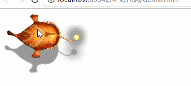

# transition进阶介绍
>过渡就是当当前元素的属性发生变化时，不是立即切换，而是逐渐的发生变化，会产生动画效果。
## transition-property 过渡属性
过渡属性是选择切换时候发生过渡的属性。
`transition-property:width;`宽度属性发生过渡
## transition-duration 过渡时间 
发生变化时整个过渡的时长。`transition-property:2s`过渡时长为2秒钟
## transition-delay 过渡延时
设定一段时间之后发生过渡
`transition-delay：3s`触发之后3秒钟之后发生过渡。
## transition-timing-function
动画过渡的方式有以下几个属性
* linear 线性 匀速
* ease 平滑过渡 慢快 慢快 默认
* ease-in 慢变快
* ease-out 块变慢
* ease-in-out 慢快慢
* cubic-bezier(<number>, <number>, <number>, <number>)： 特定的贝塞尔曲线类型，4个数值需在[0, 1]区间内。一般使用工具生成就行了。
* steps(n) 按步骤进行n是总共的步数，每进行一步就会停止一段时间
* 还有很多没啥用的不说了，上面感觉也有许多没啥用的
一般只用过渡使用简单的小动画，所以以上几种过渡方式在用户看来并没有明显的区别
## 缩写
将以上几种属性写在一起，按照上面介绍的顺序
`transition: all 2s 1s linear ` 所有属性 过渡2s 延时1s 线性过渡
## 一摸就会动的小鱼
```html
<!doctype html>
<html lang="en">
<head>
    <meta charset="UTF-8">
    <title>Document</title>
    <style>
        .fish{
            background: url('img/fish.png');
            width: 174px;
            height: 126px;
            /*border: 1px solid gray;*/
        }
        .fish:hover{
            transition: all 1s steps(11);
            background-position: 0 -1386px;
        }
    </style>
</head>
<body>
<div class="fish">

</div>
</body>
</html>
```
代码执行结果如图:

